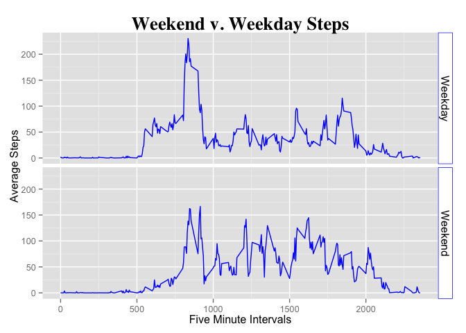

# Reproducible Research: Peer Assessment 1


## Loading and preprocessing the data
1. Load the data.

```r
act_ds <- read.csv("activity.csv")
library(dplyr) # load dplyr library for wrangling data for this project.
```
2. Process/transform the data (if necessary) into a format suitable for your analysis and calculate the total number of steps taken per day


```r
DailyStepsTotal <- act_ds %>%           # Read imported step data
        filter(!is.na(steps)) %>%       # Ingore all NA values
        group_by(date) %>%              # Group records by date
        summarise(TotSteps = sum(steps))# Sum each day's steps
```
#### What is mean total number of steps taken per day?
1. Calculate the total number of steps taken per day.  
  

```r
        sum(DailyStepsTotal$TotSteps)
```

```
## [1] 570608
```

2. Make a histogram of the total number of steps taken each day


```r
hist(as.vector(DailyStepsTotal$TotSteps), #From R's base plotting system
     main="Daily Step Count Histogram",
     col="green", border="blue",
     xlab="Steps", ylab="Days")
```

 
  
3. Calculate and report the mean and median of the total number of steps taken per day

```r
mean(DailyStepsTotal$TotSteps) # Calculate Mean
```

```
## [1] 10766.19
```

```r
median(DailyStepsTotal$TotSteps) # Calculate Median
```

```
## [1] 10765
```

## What is the average daily activity pattern?

1. Make a time series plot (i.e. type = "l") of the 5-minute interval (x-axis) and the average number of steps taken, averaged across all days (y-axis)


```r
dsInt <- act_ds %>% 
        filter(!is.na(steps)) %>% 
        group_by(interval) %>% 
        summarise(FivSteps = mean(steps))

x <- dsInt$interval
y <- dsInt$FivSteps # Average Steps Per Five Minute Interval

# Create line grqphs
plot( x,y, type="l", col="blue",ylab="Average Steps", xlab="5 Min Intervals", 
      main="All Days Averaged Steps Per 5 Minutes", fg="blue")
```

 

2. Which 5-minute interval, on average across all the days in the dataset, contains the maximum number of steps?


```r
        dsInt[which(dsInt$FivSteps == max(dsInt$FivSteps)),]
```

```
## Source: local data frame [1 x 2]
## 
##   interval FivSteps
## 1      835 206.1698
```

## Imputing missing values
1. Calculate and report the total number of missing values in the dataset (i.e. the total number of rows with NAs)


```r
        jImp <- inner_join(act_ds, dsInt, by="interval") # join dataframes to make imputation easier.
        index <- is.na(jImp$steps) # Create logical vector that flags missing step values
        sum(index) #The sum of missing values
```

```
## [1] 2304
```
2. Devise a strategy for filling in all of the missing values in the dataset. The strategy does not need to be sophisticated. For example, you could use the mean/median for that day, or the mean for that 5-minute interval.  

**Solution:** *Use the logical vector; index, to find rows with missing values and replace na with the mean from the 5-minute interval in the joined data frame.*


```r
        jImp$steps[index] <- (jImp$FivSteps[index])
```
  
3. Create a new dataset that is equal to the original dataset but with the missing data filled in.
  
**Answer** *New dataset created and structure shown to illustrate missing values have been imputed*
  

```r
        act_ds_imp <- jImp[1:3] #Create new data frame with original structure
        
        str(act_ds) #Show Structure of data frame originally created from read.csv("activity.csv")
```

```
## 'data.frame':	17568 obs. of  3 variables:
##  $ steps   : int  NA NA NA NA NA NA NA NA NA NA ...
##  $ date    : Factor w/ 61 levels "2012-10-01","2012-10-02",..: 1 1 1 1 1 1 1 1 1 1 ...
##  $ interval: int  0 5 10 15 20 25 30 35 40 45 ...
```

```r
        str(act_ds_imp) #Show struture of new data frame with imputed values
```

```
## 'data.frame':	17568 obs. of  3 variables:
##  $ steps   : num  1.717 0.3396 0.1321 0.1509 0.0755 ...
##  $ date    : Factor w/ 61 levels "2012-10-01","2012-10-02",..: 1 1 1 1 1 1 1 1 1 1 ...
##  $ interval: int  0 5 10 15 20 25 30 35 40 45 ...
```
*The* **act_ds_imp** *Data Frame created above contains the imputed value using the mean of 5-minute intervals.*

4a. Make a histogram of the total number of steps taken each day.


```r
DailyStepsTotal2 <- act_ds_imp %>%      # Read imputed step data
        group_by(date) %>%              # Group records by date
        summarise(TotSteps = sum(steps))# Sum each day's steps        

   hist(as.vector(DailyStepsTotal2$TotSteps), 
     main="Daily Step Count with Imputed Values Histogram",
     col="green", border="blue",
     xlab="Steps", ylab="Days")  
```

 
  
4b. Calculate and report the mean and median total number of steps taken per day. Do these values differ from the estimates from the first part of the assignment? 

**Answer:** *The mean did not change.  Imputing the missing values with data from the average 5 minute intervals moved the median to be equal the mean. So, there was less than 1 step difference between the below median results and the prior. This change is not significant.*
  

```r
   mean(DailyStepsTotal2$TotSteps) # Calculate the Mean total steps per day.
```

```
## [1] 10766.19
```

```r
   median(DailyStepsTotal2$TotSteps) # Calculate the Median total steps per day.
```

```
## [1] 10766.19
```
4c. What is the impact of imputing missing data on the estimates of the total daily number of steps?
  
**Answer:** *Imputing the missing values with the mean from the 5 minute interval data created 86,129.51 total additional steps for an average of 1625.085 additional steps per day.*


```r
   # Total daily steps without imputation
   sum(DailyStepsTotal$TotSteps)
```

```
## [1] 570608
```

```r
   # Total daily steps with imputation
   sum(DailyStepsTotal2$TotSteps) 
```

```
## [1] 656737.5
```

```r
   # Show total change in steps after imputing na values.
   sum(DailyStepsTotal2$TotSteps)-sum(DailyStepsTotal$TotSteps) 
```

```
## [1] 86129.51
```

```r
   # Averge change in total steps per day.
   (sum(DailyStepsTotal2$TotSteps)-sum(DailyStepsTotal$TotSteps)) / nrow(DailyStepsTotal) 
```

```
## [1] 1625.085
```

## Are there differences in activity patterns between weekdays and weekends?


1. Create a new factor variable in the dataset with two levels – “weekday” and “weekend” indicating whether a given date is a weekday or weekend day.


```r
   act_ds_imp$daytype <- ifelse ((weekdays(as.Date(act_ds_imp$date)) %in% c('Saturday','Sunday')), "Weekend","Weekday")
   
   dsInt_imp <- act_ds_imp %>% 
           group_by(daytype,interval) %>% 
           summarise(FivSteps = mean(steps))
```
  
2. Make a panel plot containing a time series plot (i.e. type = "l") of the 5-minute interval (x-axis) and the average number of steps taken, averaged across all weekday days or weekend days (y-axis). 
  

```r
   library(ggplot2) # Use ggplot for this one
   
   ggplot(data = dsInt_imp, aes(x = interval, y = FivSteps)) +
           geom_line(color = "blue") + facet_grid(daytype ~ .) +
           xlab("Five Minute Intervals") +
           theme(plot.title=element_text(family="Times", face="bold", size=20)) +
           ylab("Average Steps") +
           ggtitle("Weekend v. Weekday Steps") +
           theme(
                   strip.text.x = element_text(size = 12),
                   strip.text.y = element_text(size = 12),
                   strip.background = element_rect(colour = "blue", fill = "white")
           )
```

 
  
*The test subject appears to begin walking activities more abruptly on weekdays and are including regular longer walks as part of morning activities.  The weekend pattern suggest a more gradual increase in steps but a higher sustained levels of walking throughout the day.*
